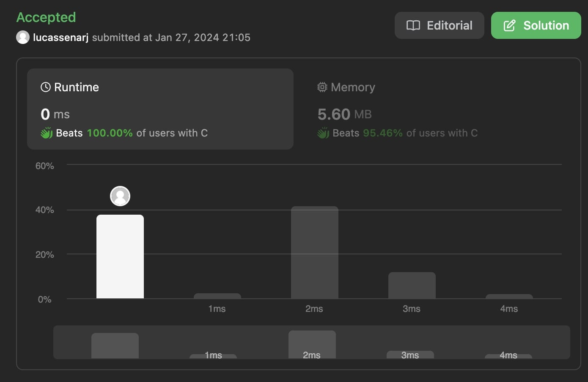

# Binary Search Exercise
- _27/01/2024_
- _[LeetCode 278 - First Bad Version](https://leetcode.com/problems/first-bad-version/description/)_

## Missing Number
You are a product manager and currently leading a team to develop a new product. Unfortunately, the latest version of your product fails the quality check. Since each version is developed based on the previous version, all the versions after a bad version are also bad.

Suppose you have `n` versions `[1, 2, ..., n]` and you want to find out the first bad one, which causes all the following ones to be bad.

You are given an API `bool isBadVersion(version)` which returns whether `version` is bad. Implement a function to find the first bad version. You should minimize the number of calls to the API.


#### Example 1:
```
Input: n = 5, bad = 4
Output: 4
Explanation:
call isBadVersion(3) -> false
call isBadVersion(5) -> true
call isBadVersion(4) -> true
Then 4 is the first bad version.
```

#### Example 2:
```
Input: n = 1, bad = 1
Output: 1
```

#### Constraints

- `1 <= bad <= n <= 2³¹ - 1`

## Leetcode score
- [Link](https://leetcode.com/problems/first-bad-version/submissions/1158603188)
